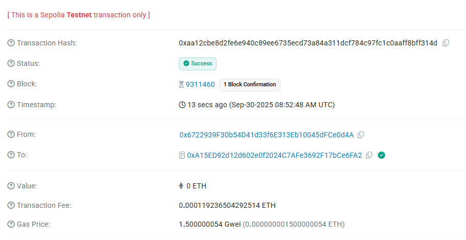

# 🌱 Private Green Travel Rewards

**Anonymous Eco-Friendly Transportation Incentives with FHE Privacy**

A blockchain-based reward system that incentivizes users to reduce their carbon footprint through eco-friendly transportation choices while maintaining complete privacy using Fully Homomorphic Encryption (FHE).

## 🎯 Core Concept

Private Green Travel Rewards is a privacy-preserving incentive system that rewards users for reducing carbon emissions through sustainable transportation. The system leverages **Fully Homomorphic Encryption (FHE)** technology to ensure that:

- 🔐 **Complete Privacy**: Your carbon savings data is encrypted and never revealed publicly
- 🎁 **Fair Rewards**: Automated tier-based reward calculation without exposing individual contributions
- 🌍 **Environmental Impact**: Encourages eco-friendly transportation choices (walking, cycling, public transit, carpooling)
- ⛓️ **Blockchain Transparency**: Verifiable rewards distribution while maintaining user anonymity

### How It Works

1. **Weekly Reward Periods**: Each period lasts 7 days
2. **Private Submission**: Users submit encrypted carbon savings data using FHE
3. **Tiered Rewards**:
   - 🥉 **Bronze** (1,000-4,999g CO2e): 10 tokens
   - 🥈 **Silver** (5,000-9,999g CO2e): 25 tokens
   - 🥇 **Gold** (10,000g+ CO2e): 50 tokens
4. **Anonymous Processing**: Rewards are calculated on encrypted data without revealing individual amounts
5. **Claim Anytime**: Users can claim their accumulated rewards whenever they want

## 📋 Smart Contract

**Contract Address**: `0xA15ED92d12d602e0f2024C7AFe3692F17bCe6FA2`

**Network**: Sepolia Testnet

**Verification**: [View on Etherscan](https://sepolia.etherscan.io/address/0xA15ED92d12d602e0f2024C7AFe3692F17bCe6FA2)

### Key Features

- ✅ FHE-encrypted carbon savings submissions
- ✅ Automatic tier-based reward calculation
- ✅ Weekly reward period management
- ✅ Lifetime statistics tracking
- ✅ Zero-knowledge privacy guarantees

## 🚀 Live Application

**Website**: [https://private-green-travel-rewards.vercel.app/](https://private-green-travel-rewards.vercel.app/)

The application provides:
- 🔗 MetaMask wallet integration
- 📊 Real-time period status tracking
- 📈 Personal statistics dashboard
- 🎮 Admin controls for period management
- 💎 Modern glassmorphism UI design

## 📸 Demo & Screenshots

### Video Demonstration

[Watch Demo Video](./Demo Video.mp4)

*Video showcasing the complete user flow from connecting wallet to claiming rewards*

### On-Chain Transaction Examples

#### Period Started Transaction

*Transaction showing a new reward period being initiated*

## 🛠️ Technology Stack

### Smart Contract
- **Solidity** 0.8.24
- **FHE Library**: @fhevm/solidity v0.5.0
- **Development**: Hardhat
- **Network**: Zama FHE-enabled blockchain

### Frontend
- **Pure HTML5/CSS3/JavaScript** - No build tools required
- **Web3 Integration**: ethers.js v5.7.2 (CDN)
- **Styling**: Modern glassmorphism design with dark theme
- **Hosting**: Vercel serverless deployment

### Privacy Technology
- **FHE (Fully Homomorphic Encryption)**: Enables computation on encrypted data
- **Zero-Knowledge**: Users maintain complete privacy of their travel patterns
- **Zama Network**: Specialized blockchain infrastructure for FHE operations

## 🎨 User Interface

The application features a modern, responsive design with:

- 🌙 **Dark Glassmorphism Theme**: Sleek, translucent cards with backdrop blur
- 💫 **Smooth Animations**: Hover effects and transitions
- 📱 **Mobile Responsive**: Fully optimized for all device sizes
- 🎯 **Intuitive Navigation**: Clear status indicators and action buttons
- ⚡ **Real-time Updates**: Live blockchain event monitoring

## 🔐 Privacy Guarantees

1. **Encrypted Submissions**: All carbon savings data is encrypted using FHE before being sent to the blockchain
2. **Private Computation**: Reward calculations are performed on encrypted data
3. **No Data Leakage**: Individual carbon savings amounts are never revealed publicly
4. **Verifiable Rewards**: Users can verify their rewards without exposing their contribution

## 💡 Use Cases

### Individual Users
- Track and monetize your eco-friendly transportation choices
- Maintain complete privacy of your travel patterns
- Earn rewards for sustainable behavior

### Organizations
- Implement employee green commuting incentive programs
- Encourage sustainable transportation without tracking individual movements
- Demonstrate corporate environmental responsibility

### Cities & Municipalities
- Promote public transportation and active mobility
- Reduce urban carbon emissions
- Support citizens' privacy while achieving environmental goals

## 📊 Contract Statistics

- **Minimum Qualification**: 1,000g CO2e saved
- **Period Duration**: 7 days
- **Reward Calculation**: Automatic on period end
- **Privacy Level**: Complete anonymity via FHE

## 🤝 Contributing

We welcome contributions! The project is built with:
- Clean, well-documented Solidity code
- Zero-dependency frontend for easy understanding
- FHE best practices for privacy preservation

## 🔗 Links

- **GitHub Repository**: [https://github.com/RileyLueilwitz/PrivateGreenTravelRewards](https://github.com/RileyLueilwitz/PrivateGreenTravelRewards)
- **Live Application**: [https://private-green-travel-rewards.vercel.app/](https://private-green-travel-rewards.vercel.app/)
- **Contract Address**: `0xA15ED92d12d602e0f2024C7AFe3692F17bCe6FA2`
- **Zama Documentation**: [https://docs.zama.ai](https://docs.zama.ai)

## 📄 License

This project is licensed under the MIT License - see the [LICENSE](LICENSE) file for details.

## 🌟 Acknowledgments

- **Zama** - For providing the FHE infrastructure and libraries
- **Ethereum Foundation** - For the robust blockchain platform
- **Environmental Organizations** - For inspiring sustainable technology solutions

---

**Built with 💚 for a sustainable future**

*Join us in making eco-friendly transportation rewarding and private!*